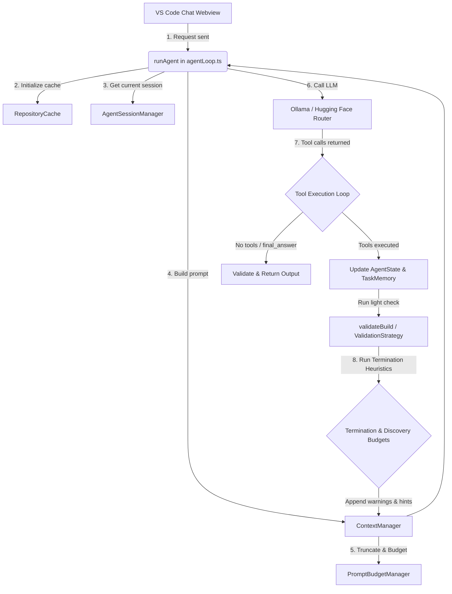

# GBS SE Agent - Getting Started

GBS SE Agent is an autonomous, tool-driven coding agent that runs locally via Ollama or connects to Hugging Face Cloud for serverless model execution.

## 1. Prerequisites & Installation

### Option A: Use Local Models (Ollama)
1. Download and install Ollama from [ollama.com/download](https://ollama.com/download).
2. Start Ollama and verify it is running:
   ```bash
   ollama --version
   ```
3. Pull your preferred coding model (Qwen 2.5 Coder is highly recommended):
   ```bash
   ollama pull qwen2.5-coder:7b
   ```
4. Verify reachable models:
   ```bash
   ollama list
   ```

### Option B: Use Cloud Models (Hugging Face Cloud Serverless)
No local model installation is required! You only need a free Hugging Face account:
1. Go to [Hugging Face Access Tokens Settings](https://huggingface.co/settings/tokens).
2. Generate a new Access Token with **Read** role permissions.
3. Keep the `hf_...` token ready to copy.

---

## 2. Install the Extension

1. Open VS Code.
2. Go to the Extensions view (`Ctrl+Shift+X`).
3. Search for **GBS SE Agent** and click **Install**.

---

## 3. Configure Your Model & Provider

Open the GBS SE Agent chat panel from the VS Code Activity Bar (represented by a robot icon).

At the bottom of the sidebar, configure your settings:
* **Dropdown Selection**: Choose between **Ollama** (local execution) or **Hugging Face** (cloud execution).
* **Model Field**:
  * For **Ollama**, type the model tag you have installed locally (e.g., `qwen2.5-coder:7b` or your cloud profile `gemma4:31b-cloud`).
  * For **Hugging Face**, input the Hugging Face repository ID for any supported inference model. Highly recommended:
    * `Qwen/Qwen2.5-Coder-32B-Instruct`
    * `meta-llama/Llama-3.2-3B-Instruct`
* **Entering Your API Key (Hugging Face Only)**:
  * When you send your first message with the Hugging Face provider active, a secure password input prompt will slide down from the top of VS Code. 
  * Paste your `hf_...` Access Token. The extension registers and saves it securely in VS Code configurations so you only do it once.

---

## 4. Run the Agent

Open any project folder in VS Code. The agent will automatically discover the workspace tree and index configuration files.

Submit your request in the prompt box:
```text
Add JWT authentication to this React project.
```
The agent loop will:
1. Scan relevant folder pathways.
2. Retrieve context and symbols.
3. Make incremental, patch-based file writes using VS Code WorkspaceEdit.
4. Execute build checks (`npm run build` or `tsc --noEmit`) to correct errors automatically.
5. Notify you upon final success.

---

## Manual Build and Developer Setup

If you want to clone the repository and build the VSIX file manually:

### 1. Clone & Install Dependencies
```bash
git clone https://github.com/anandhuremanan/gb-codex.git
cd gbs-local-dev
npm install
```

### 2. Configure Settings in Code
If you want to modify default settings or hardcode model fallback logic, edit the fetch routines in [src/agent/agentLoop.ts](file:///d:/inittest_vsext/gbs-local-dev/src/agent/agentLoop.ts):
```typescript
// Example: Modifying the local Ollama API body
response = await fetch("http://localhost:11434/api/chat", {
  method: "POST",
  headers: { "Content-Type": "application/json" },
  body: JSON.stringify({
    model: "your-custom-model",
    messages,
    stream: true
  })
});
```

### 3. Build & Package VSIX
To package the extension into an installable `.vsix` file:
```bash
npm run compile
npx vsce package
```
In VS Code, go to the Extensions panel, click the `...` menu, select **Install from VSIX...**, and choose the generated `.vsix` file.

---

## Troubleshooting

### Connection to Hugging Face Failed (`fetch failed`)
* Ensure you are not behind a corporate VPN or proxy blocking raw Node.js HTTPS requests.
* Double-check that your model ID is spelled correctly (e.g. `Qwen/Qwen2.5-Coder-32B-Instruct`).
* Ensure your Hugging Face Token starts with `hf_` and has valid Read permissions.

### Extension cannot connect to Ollama
* Verify Ollama is running in the background (`curl http://localhost:11434`).
* Check if the model you entered in the input bar is listed under `ollama list`.

---

## Agent Architecture for Nerds

This part of the document explains the architecture of the **GBS SE Agent** extension, detailing how each component works, the role of each file, and the overall execution flow.



### Core Components and File Map

* **[src/extension.ts](file:///d:/inittest_vsext/gbs-local-dev/src/extension.ts)**: Entry point registering the custom activity sidebar provider.
* **[src/chatView.ts](file:///d:/inittest_vsext/gbs-local-dev/src/chatView.ts)**: Houses the webview, managing layout restores and dropdown selector settings.
* **[src/agent/agentLoop.ts](file:///d:/inittest_vsext/gbs-local-dev/src/agent/agentLoop.ts)**: Orchestrates the LLM step loop, handles Ollama vs Hugging Face Router API routing, and validates tool parameters.
* **[src/agent/sessionManager.ts](file:///d:/inittest_vsext/gbs-local-dev/src/agent/sessionManager.ts)**: Saves task histories and goal contexts dynamically to `.vscode/bunker-session.json`.
* **[src/agent/registry.ts](file:///d:/inittest_vsext/gbs-local-dev/src/agent/registry.ts)**: Declares and registers the available tools (`list_workspace_files`, `read_file`, `write_file`, `create_file`, `replace_in_file`, `search_symbols`, `run_terminal_command`, `finish`, `get_directory_context`).
* **[src/agent/validator.ts](file:///d:/inittest_vsext/gbs-local-dev/src/agent/validator.ts)**: Executes compiler checkers dynamically to report warnings.
